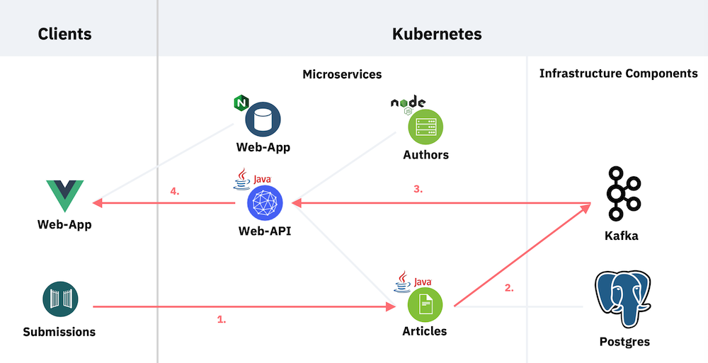

# Workshop: Reactive Messaging with Quarkus on OpenShift

In this workshop you'll learn how to implement reactive messaging functionality with Java, [Quarkus](https://quarkus.io/), [Kafka](https://kafka.apache.org/), [Vert.x](https://vertx.io/) and [MicroProfile](https://microprofile.io/). An end-to-end sample application will be deployed to [Red Hat OpenShift](https://www.openshift.com/).

The code is available as open source as part of the [Cloud Native Starter](https://github.com/IBM/cloud-native-starter/tree/master/reactive) project.

One benefit of reactive models is the ability to update web applications by sending messages, rather than pulling for updates. This is more efficient and improves the user experience.

The workshop uses a sample application to demonstrate reactive functionality. The simple application displays links to articles and author information.

Articles can be created via REST API. The web application receives a notification and adds the new article to the page. The animation shows how curl requests are executed at the bottom which trigger updates to the web application at the top.

### Architecture

The next diagram explains the flow between the different components and microservices.

1. API client 'Submissions' triggers the REST API of the 'Articles' service to create new articles.
2. The 'Articles' service sends a message to the 'Web-API' service via 'Kafka'.
3. The 'Web-API' provides a streaming endpoint
4. The web application 'Web-App' consumes the streaming endpoint

Note that in this workshop you will deploy the full application as described in the previous diagram. But to simplify the workshop you'll re-implement a simpler version of the 'Web-API' service which only invokes the 'Articles' service.

### Estimated time and level

|  Time | Level  |
| - | - |
| one hour | beginners |

### Objectives

After you complete this workshop, you'll understand the following reactive functionality:

* Sending and receiving Kafka messages via MicroProfile
* Sending events from microservices to web applications via Server Sent Events
* Sending in-memory messages via MicroProfile and Vert.x Event Bus

*The intention of this workshop is not to explain every aspect of reactive programming, but to explain core reactive principles and to deploy a complete reactive application which you can inspect after the workshop in more detail.*

### About this workshop

The introductory page of the workshop is broken down into the following sections:

* [Agenda](#agenda)
* [Compatibility](#compatibility)
* [Technology Used](#technology-used)
* [Credits](#credits)
* [What`s next?](#whats-next?)

### Agenda

These are the labs of this workshop, go through all of them in sequence, start with pre work:

|   |   |
| - | - |
| [Pre work](pre-work/README.md) | Create your Cloud Environment |
| [Exercise 1](exercise-01/README.md) | Deploy example application via Script |
| [Exercise 2](exercise-02/README.md) | Reactive Messaging with MicroProfile |
| [Exercise 3](exercise-03/README.md) | Server Sent Events |
| [Exercise 4](exercise-04/README.md) | Vert.x Event Bus |
| [Exercise 5 (optional)](exercise-05/README.md) | Use distributed Logging |

### Compatibility

This workshop has been tested on the following platforms:

* **IBM Open Shift**: version 4.3
* **IBM Cloud Shell**: beta

### Technology Used

* [Jakarta EE](https://jakarta.ee/)
* [MicroProfile](https://microprofile.io/)
* [Quarkus](https://quarkus.io/)
* [Apache Kafka](https://kafka.apache.org/)
* [PostgresSQL](https://www.postgresql.org/)
* [RedHat OpenShift](https://www.openshift.com/)
* [Microservices architecture](https://en.wikipedia.org/wiki/Microservices)
* [Vue.js](https://vuejs.org/)

### Credits

* [Niklas Heidloff](https://twitter.com/nheidloff)
* [Harald Uebele](https://twitter.com/Harald_U)
* [Thomas Südbröcker](https://twitter.com/tsuedbroecker)

### What`s next?

The [blogs](https://github.com/IBM/cloud-native-starter/tree/master/reactive#blogs) as well as the [presentation](images/ReactiveMicroservices.pdf) describe the functionality in more detail.
